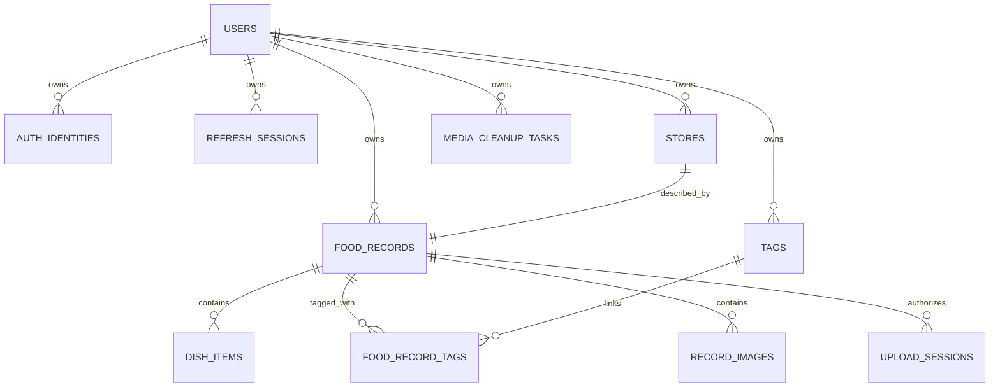

# 《食迹》数据库设计（MVP）

## 1. 设计范围

本设计面向 PostgreSQL 与 Prisma ORM，覆盖登录身份、私人店铺、当前美食记录、标签、菜品、图片和上传清理流程。第一阶段只定义模型，不创建数据库、不生成 Prisma Client、不执行迁移。

## 2. 关键决策

1. 采用单体 PostgreSQL，不拆库、不分片。
2. 主键统一使用 UUID，数据库列使用 `snake_case`，应用字段使用 `camelCase`。
3. 所有时间点使用 `timestamptz` 并以 UTC 存储；用户到店日期使用 `date`。
4. 经纬度统一保存 `GCJ-02`，使用 `numeric(10,7)`，不在 MVP 引入 PostGIS。
5. 三种默认清单由 `food_records.status` 派生，不创建 `lists` 表。
6. 同一用户对同一店铺仅维护一条 `food_records`；多次到店历史延后。
7. 用户删除记录时执行硬删除，避免软删除过滤遗漏；可复用的标签不随记录删除。
8. 图片对象采用私有 COS，数据库只保存 `object_key`，不保存长期可访问 URL。
9. 每一张用户业务表都显式包含 `user_id`，关联表也不例外。

不采用 PostGIS 的原因：私人数据量预计较小，MVP 的地图范围查询可以使用边界框与球面距离公式完成；这能减少本地、测试和云数据库的扩展依赖。若单用户记录量或地理查询复杂度显著增加，再以压测数据评审 PostGIS。

## 3. 数据关系



图中 `STORES` 与 `FOOD_RECORDS` 在 MVP 为一对一业务关系；物理外键仍由 `food_records.store_id` 指向店铺，便于未来引入多次到店模型时演进。

## 4. 枚举

| Enum | Values | 说明 |
| --- | --- | --- |
| `UserStatus` | `ACTIVE`, `DISABLED` | 用户状态 |
| `AuthProvider` | `WECHAT_MINI_PROGRAM`, `WECHAT_MOBILE` | 微信身份来源 |
| `ClientPlatform` | `MINI_PROGRAM`, `ANDROID`, `IOS` | 会话客户端 |
| `StoreSource` | `TENCENT_POI`, `MANUAL` | 店铺来源 |
| `CoordinateType` | `GCJ02` | MVP 唯一坐标系 |
| `RecordStatus` | `WANT_TO_GO`, `VISITED`, `BLACKLISTED` | 记录状态/默认清单 |
| `DishType` | `RECOMMENDED`, `AVOIDED` | 菜品类型 |
| `UploadStatus` | `PENDING`, `COMPLETED`, `EXPIRED`, `FAILED` | 临时上传状态 |
| `CleanupStatus` | `PENDING`, `PROCESSING`, `COMPLETED`, `FAILED` | 媒体清理状态 |

Prisma 枚举名称使用上表标识，数据库枚举值保持一致。已有枚举值不改名；新增值必须考虑旧客户端兼容。

## 5. 表设计

除特别说明外，所有主键为 `uuid NOT NULL DEFAULT gen_random_uuid()`，时间字段为 `timestamptz NOT NULL DEFAULT now()`。

### 5.1 `users`

| Column | Type | Nullable | Default | 说明 |
| --- | --- | --- | --- | --- |
| `id` | `uuid` | 否 | UUID | 用户主键，也是 JWT subject 映射目标 |
| `nickname` | `varchar(80)` | 是 |  | 微信昵称或用户设置的昵称 |
| `avatar_object_key` | `varchar(512)` | 是 |  | 私有头像对象键；MVP 可不启用头像上传 |
| `timezone` | `varchar(64)` | 否 | `Asia/Shanghai` | 日期统计时区 |
| `locale` | `varchar(16)` | 否 | `zh-CN` | 用户语言 |
| `status` | `UserStatus` | 否 | `ACTIVE` | 账号状态 |
| `last_login_at` | `timestamptz` | 是 |  | 最近登录时间 |
| `created_at` | `timestamptz` | 否 | `now()` | 创建时间 |
| `updated_at` | `timestamptz` | 否 | `now()` | 更新时间 |

`users` 是用户根实体，因此自身不再重复 `user_id`。所有从属业务表必须包含并外键关联 `users.id`。

### 5.2 `auth_identities`

| Column | Type | Nullable | 说明 |
| --- | --- | --- | --- |
| `id` | `uuid` | 否 | 主键 |
| `user_id` | `uuid` | 否 | 所属用户 |
| `provider` | `AuthProvider` | 否 | 身份来源 |
| `provider_app_id` | `varchar(64)` | 否 | 对应微信应用 `appId`，不是密钥 |
| `provider_user_id` | `varchar(128)` | 否 | 微信 `openId`，敏感数据 |
| `union_id` | `varchar(128)` | 是 | 微信 `unionId`，用于符合条件的跨端关联 |
| `created_at` | `timestamptz` | 否 | 创建时间 |
| `updated_at` | `timestamptz` | 否 | 更新时间 |

约束与索引：

- `UNIQUE (provider, provider_app_id, provider_user_id)`；
- `INDEX (user_id)`；
- `INDEX (union_id) WHERE union_id IS NOT NULL`，只用于受控的账号关联查询，不假设其在所有微信应用中存在。

不得保存微信 `session_key`、移动端 `access_token` 或 `refresh_token` 的明文长期副本；交换完成后仅在请求生命周期内使用。

### 5.3 `refresh_sessions`

| Column | Type | Nullable | 说明 |
| --- | --- | --- | --- |
| `id` | `uuid` | 否 | 会话主键，同时作为 JWT `jti` 关联值 |
| `user_id` | `uuid` | 否 | 所属用户 |
| `token_hash` | `varchar(128)` | 否 | 刷新令牌的不可逆哈希 |
| `platform` | `ClientPlatform` | 否 | 客户端平台 |
| `device_id_hash` | `varchar(128)` | 是 | 客户端安装标识的哈希，不保存硬件标识明文 |
| `expires_at` | `timestamptz` | 否 | 过期时间 |
| `last_used_at` | `timestamptz` | 是 | 最近轮换时间 |
| `revoked_at` | `timestamptz` | 是 | 主动退出或风险吊销时间 |
| `created_at` | `timestamptz` | 否 | 创建时间 |

索引：`INDEX (user_id, revoked_at)`、`INDEX (expires_at)`。刷新时执行令牌轮换，旧哈希立即失效。

### 5.4 `stores`

| Column | Type | Nullable | 说明 |
| --- | --- | --- | --- |
| `id` | `uuid` | 否 | 店铺主键 |
| `user_id` | `uuid` | 否 | 店铺数据所有者 |
| `source` | `StoreSource` | 否 | 腾讯 POI 或手动录入 |
| `map_poi_id` | `varchar(128)` | 是 | 腾讯 POI 标识；Prisma 字段为 `mapPoiId`，手动店铺为空 |
| `name` | `varchar(100)` | 否 | 店铺名称 |
| `category` | `varchar(100)` | 是 | 分类快照 |
| `phone` | `varchar(50)` | 是 | 联系电话快照 |
| `address` | `varchar(300)` | 是 | 完整地址 |
| `province` | `varchar(60)` | 是 | 省级行政区 |
| `city` | `varchar(60)` | 是 | 城市 |
| `district` | `varchar(60)` | 是 | 区县 |
| `latitude` | `numeric(10,7)` | 否 | 纬度，-90 至 90 |
| `longitude` | `numeric(10,7)` | 否 | 经度，-180 至 180 |
| `coordinate_type` | `CoordinateType` | 否 | 固定 `GCJ02` |
| `created_at` | `timestamptz` | 否 | 创建时间 |
| `updated_at` | `timestamptz` | 否 | 更新时间 |

约束与索引：

- `CHECK (latitude BETWEEN -90 AND 90)`；
- `CHECK (longitude BETWEEN -180 AND 180)`；
- `CHECK ((source = 'TENCENT_POI' AND map_poi_id IS NOT NULL AND btrim(map_poi_id) <> '') OR source = 'MANUAL')`；
- `UNIQUE (user_id, map_poi_id)`；同一用户内按腾讯 POI 去重，PostgreSQL 允许多个空值，因此手动店铺不受误限制；
- `UNIQUE (user_id, id)`，为复合外键提供目标；
- `INDEX (user_id, city)`、`INDEX (user_id, latitude)`、`INDEX (user_id, longitude)`；
- 店铺名与地址使用 `pg_trgm` GIN 索引，具体 SQL 由迁移文件管理。

### 5.5 `food_records`

| Column | Type | Nullable | Default | 说明 |
| --- | --- | --- | --- | --- |
| `id` | `uuid` | 否 | UUID | 记录主键 |
| `user_id` | `uuid` | 否 |  | 所属用户 |
| `store_id` | `uuid` | 否 |  | 店铺快照 |
| `status` | `RecordStatus` | 否 |  | 三种状态之一 |
| `overall_rating` | `numeric(2,1)` | 是 |  | 总体评分 |
| `taste_rating` | `numeric(2,1)` | 是 |  | 口味评分 |
| `environment_rating` | `numeric(2,1)` | 是 |  | 环境评分 |
| `service_rating` | `numeric(2,1)` | 是 |  | 服务评分 |
| `per_capita_price` | `numeric(10,2)` | 是 |  | 人均消费 |
| `currency` | `char(3)` | 否 | `CNY` | MVP 固定币种 |
| `visited_at` | `date` | 是 |  | 到店日期 |
| `notes` | `text` | 是 |  | 私人备注，最多 5,000 字符由应用校验 |
| `version` | `integer` | 否 | `1` | 乐观锁版本 |
| `created_at` | `timestamptz` | 否 | `now()` | 创建时间 |
| `updated_at` | `timestamptz` | 否 | `now()` | 更新时间 |

约束与索引：

- `UNIQUE (user_id, store_id)`，保证一店一条当前记录；
- `UNIQUE (user_id, id)`；
- 复合外键 `(user_id, store_id) REFERENCES stores(user_id, id) ON DELETE CASCADE`；
- 四个评分分别满足 `rating IS NULL OR (rating BETWEEN 1.0 AND 5.0 AND rating * 2 = trunc(rating * 2))`；
- `CHECK (per_capita_price IS NULL OR per_capita_price >= 0)`；
- `CHECK (currency = 'CNY')`；
- `CHECK (version > 0)`；
- `INDEX (user_id, status, updated_at DESC, id DESC)`；
- `INDEX (user_id, visited_at DESC)`；
- `INDEX (user_id, overall_rating DESC)`；
- `notes` 可使用 `pg_trgm` 索引；私人数据量较小时先观察索引收益。

更新语句必须同时匹配 `id`、`user_id`、`version`，成功后执行 `version = version + 1`。影响行数为 0 时，再区分资源不存在与版本冲突，但对客户端不泄露其他用户资源。

### 5.6 `dish_items`

| Column | Type | Nullable | 说明 |
| --- | --- | --- | --- |
| `id` | `uuid` | 否 | 主键 |
| `user_id` | `uuid` | 否 | 所属用户 |
| `record_id` | `uuid` | 否 | 所属记录 |
| `type` | `DishType` | 否 | 推荐或踩雷 |
| `name` | `varchar(50)` | 否 | 原始展示名 |
| `normalized_name` | `varchar(50)` | 否 | 去空格并大小写归一化后的名称 |
| `sort_order` | `smallint` | 否 | 同类排序，从 0 开始 |
| `created_at` | `timestamptz` | 否 | 创建时间 |

约束：复合外键 `(user_id, record_id)` 指向 `food_records` 并 `ON DELETE CASCADE`；`UNIQUE (user_id, record_id, type, normalized_name)`；`CHECK (sort_order >= 0)`。

### 5.7 `tags`

| Column | Type | Nullable | 说明 |
| --- | --- | --- | --- |
| `id` | `uuid` | 否 | 主键 |
| `user_id` | `uuid` | 否 | 所属用户 |
| `name` | `varchar(20)` | 否 | 展示名称 |
| `normalized_name` | `varchar(20)` | 否 | 去空格与大小写归一化值 |
| `color` | `varchar(7)` | 是 | `#RRGGBB`，为空使用客户端默认色 |
| `created_at` | `timestamptz` | 否 | 创建时间 |
| `updated_at` | `timestamptz` | 否 | 更新时间 |

约束：`UNIQUE (user_id, normalized_name)`、`UNIQUE (user_id, id)`、`CHECK (color IS NULL OR color ~ '^#[0-9A-Fa-f]{6}$')`。

### 5.8 `food_record_tags`

| Column | Type | Nullable | 说明 |
| --- | --- | --- | --- |
| `user_id` | `uuid` | 否 | 所属用户，防止跨用户关联 |
| `record_id` | `uuid` | 否 | 记录 |
| `tag_id` | `uuid` | 否 | 标签 |
| `created_at` | `timestamptz` | 否 | 关联时间 |

主键为 `(record_id, tag_id)`。同时设置：

- `(user_id, record_id)` 到 `food_records(user_id, id)` 的级联外键；
- `(user_id, tag_id)` 到 `tags(user_id, id)` 的级联外键；
- `INDEX (user_id, tag_id, record_id)`。

双复合外键在数据库层阻止把用户 A 的记录关联到用户 B 的标签。

### 5.9 `record_images`

| Column | Type | Nullable | 说明 |
| --- | --- | --- | --- |
| `id` | `uuid` | 否 | 图片主键 |
| `user_id` | `uuid` | 否 | 所属用户 |
| `record_id` | `uuid` | 否 | 所属记录 |
| `object_key` | `varchar(512)` | 否 | COS 最终对象键，不含签名参数 |
| `mime_type` | `varchar(64)` | 否 | 经服务端校验后的 MIME |
| `size_bytes` | `bigint` | 否 | 对象大小 |
| `width` | `integer` | 是 | 像素宽度 |
| `height` | `integer` | 是 | 像素高度 |
| `checksum` | `varchar(128)` | 是 | 校验摘要 |
| `sort_order` | `smallint` | 否 | 0 至 8 |
| `created_at` | `timestamptz` | 否 | 创建时间 |

约束：复合外键 `(user_id, record_id)` 级联删除；`UNIQUE (object_key)`；`UNIQUE (record_id, sort_order)`；大小为 1 至 10 MB；宽高为正数或空。服务层保证单条记录不超过 9 张。

建议最终键格式：

```text
private/users/{userId}/records/{recordId}/{imageId}.{extension}
```

### 5.10 `upload_sessions`

| Column | Type | Nullable | 说明 |
| --- | --- | --- | --- |
| `id` | `uuid` | 否 | 上传会话主键 |
| `user_id` | `uuid` | 否 | 所属用户 |
| `record_id` | `uuid` | 否 | 目标记录 |
| `pending_object_key` | `varchar(512)` | 否 | 临时上传对象键 |
| `expected_mime_type` | `varchar(64)` | 否 | 申请时声明类型 |
| `max_size_bytes` | `bigint` | 否 | 临时凭证允许上限 |
| `status` | `UploadStatus` | 否 | 上传状态 |
| `expires_at` | `timestamptz` | 否 | 会话过期时间 |
| `completed_at` | `timestamptz` | 是 | 确认完成时间 |
| `created_at` | `timestamptz` | 否 | 创建时间 |

约束：复合外键 `(user_id, record_id)` 级联删除；`UNIQUE (pending_object_key)`；`INDEX (user_id, status, expires_at)`。

临时键格式：

```text
pending/users/{userId}/records/{recordId}/{uploadSessionId}
```

完成接口通过 COS `HEAD` 校验对象后，由服务端复制到最终键、创建 `record_images` 并删除临时对象。COS 对 `pending/` 配置短周期生命周期清理，处理未完成上传。

### 5.11 `media_cleanup_tasks`

| Column | Type | Nullable | 说明 |
| --- | --- | --- | --- |
| `id` | `uuid` | 否 | 清理任务主键 |
| `user_id` | `uuid` | 否 | 原对象所属用户 |
| `object_key` | `varchar(512)` | 否 | 待删除最终对象键 |
| `status` | `CleanupStatus` | 否 | 任务状态 |
| `attempts` | `smallint` | 否 | 已尝试次数 |
| `next_attempt_at` | `timestamptz` | 否 | 下次执行时间 |
| `last_error_code` | `varchar(100)` | 是 | 脱敏错误码，不保存签名 URL |
| `created_at` | `timestamptz` | 否 | 创建时间 |
| `updated_at` | `timestamptz` | 否 | 更新时间 |

删除图片或记录的数据库事务先写入清理任务，再删除业务行。NestJS 进程内的定时任务使用 `FOR UPDATE SKIP LOCKED` 小批量领取并重试，不引入消息队列。旧签名 URL 仅在短时有效，删除后后端不再签发新 URL。

约束与索引：`UNIQUE (object_key)`、`INDEX (status, next_attempt_at)`、`CHECK (attempts >= 0)`。

## 6. `userId` 隔离策略

### 6.1 数据库层

- 除 `users` 根实体外，所有用户数据表均有非空 `user_id` 外键。
- 父子表同时声明 `UNIQUE (user_id, id)` 和复合外键，防止跨用户错误关联，并让用户隔离条件成为索引左前缀。
- 业务唯一约束均以 `user_id` 开头，例如标签名和腾讯 POI 去重。
- 不使用共享的全局 `stores` 主数据，避免个人修改互相影响。

### 6.2 应用层

- `userId` 只从已验证 JWT 的 `sub` 映射，不接受 body、query 或 route 中的 `userId`。
- Prisma 所有读取、更新和删除均以 `{ id, userId }` 或等价复合条件查询。
- 创建子资源前检查父资源属于当前用户；使用事务避免检查与写入之间的竞态。
- 对越权和不存在统一返回 `404`。
- Repository 方法要求显式传入认证上下文，禁止暴露无租户条件的通用 `findUnique(id)` 给业务层。

### 6.3 测试层

每类资源至少包含以下集成测试：

1. 用户 A 可以操作自己的资源；
2. 用户 A 读取用户 B 的 ID 返回 `404`；
3. 用户 A 更新或删除用户 B 的 ID 返回 `404` 且数据未变化；
4. 用户 A 不能把自己的子项关联到用户 B 的父项；
5. 搜索、地图、统计和图片签名结果不包含用户 B 数据；
6. 伪造请求中的 `userId` 字段被 DTO 白名单拒绝。

### 6.4 PostgreSQL RLS 决策

MVP 暂不启用 Row Level Security。Prisma 连接池下若依赖会话变量，必须确保每个事务设置并清理租户上下文，否则会引入隐蔽风险。当前采用复合外键、强制 Repository 约束和跨用户集成测试。正式上线前进行一次隔离审计；若未来出现多种数据库访问入口，再评审事务级 RLS。

## 7. 删除与级联规则

| 操作 | 数据行为 |
| --- | --- |
| 删除记录 | 事务中为图片写清理任务；级联删除菜品、标签关联、图片元数据、上传会话和记录；若店铺无引用则删除店铺 |
| 删除图片 | 写清理任务后删除 `record_images`，重新压紧 `sort_order` |
| 删除标签 | 级联删除 `food_record_tags`，不删除记录 |
| 吊销会话 | 设置 `revoked_at`，保留短期安全审计数据 |
| 删除用户 | 不属于当前 MVP UI；未来需专门事务/后台任务清除全部业务数据与 COS 对象 |

业务表不采用软删除，因此所有查询无需重复 `deleted_at IS NULL`，降低私人数据误展示风险。

## 8. 查询与统计设计

### 8.1 列表分页

使用游标分页而非 offset。游标包含主排序值与 `id`，例如最近更新排序使用 `(updated_at, id)`，从而在相同时间下保持稳定顺序。游标由服务端编码并校验，客户端不得拼接 SQL 字段。

### 8.2 文本搜索

MVP 对当前用户范围内的 `stores.name`、`stores.address`、`food_records.notes`、`dish_items.name` 和 `tags.name` 做大小写不敏感包含查询。使用 `pg_trgm` 改善店铺名与地址的模糊匹配；中文分词和专用搜索服务不进入 MVP。

### 8.3 地图范围

边界框条件：

```sql
user_id = :userId
AND latitude BETWEEN :south AND :north
AND longitude BETWEEN :west AND :east
```

跨越 180 度经线时拆成两个经度区间。距离排序使用参数化的 Haversine 公式，并先以边界框缩小候选集。所有 SQL 参数化，禁止拼接坐标或排序字段。

### 8.4 基础统计

- 状态分布：按 `status` 分组计数；
- 平均总体评分：`AVG(overall_rating)` 并同时返回非空样本数；
- 平均人均消费：`AVG(per_capita_price)` 并返回非空样本数；
- 常用标签：关联表按标签计数，`count DESC, tag_id ASC`，最多 10 个。

统计结果不持久化。达到性能瓶颈后再考虑缓存或物化视图。

## 9. Prisma 与迁移约定

- Prisma schema 是模型声明入口，迁移 SQL 是数据库真实变更记录。
- `pg_trgm`、表达式索引、复合外键或 Prisma 无法完整表达的约束，写入受版本控制的迁移 SQL，不在应用启动时动态创建。
- 迁移先在空库和前一版本快照各执行一次，再运行 Prisma 校验与集成测试。
- 生产迁移只允许向前执行；需要回退时使用新的修复迁移，不删除已发布迁移历史。
- 种子数据只包含测试或开发数据，不创建真实微信身份、不包含生产对象键。
- Prisma 日志在生产环境不得记录含用户备注或签名参数的完整查询参数。

## 10. 备份与数据保留

- 开发环境可使用本地 Docker PostgreSQL；测试环境每次测试使用隔离数据库或 schema。
- 生产环境启用自动备份、时间点恢复能力与加密存储，具体提供商和保留周期在部署阶段确认。
- `refresh_sessions`、已完成上传会话和清理任务需要定期归档或删除，保留周期在安全评审中确定。
- COS `pending/` 前缀配置短周期生命周期规则；`private/` 前缀不得设置会误删有效记录的统一过期规则。
- 恢复演练必须验证数据库元数据与 COS 对象的对应关系，而不仅是数据库可连接。

## 11. 数据库验收标准

- 所有模型、约束、索引和级联行为均有迁移测试。
- 任意用户业务表不存在可空的 `user_id`。
- 数据库约束能拒绝跨用户父子关联、非法评分、非法坐标和负数消费。
- 并发更新只有一个请求能以相同 `version` 成功。
- 删除记录后业务行不可查询，图片清理任务完整且可重试。
- 列表、地图和统计查询的执行计划以 `user_id` 为首要过滤条件。
- Prisma schema 格式检查、校验、生成、类型检查和数据库集成测试全部实际通过后，才可进入下一阶段。
